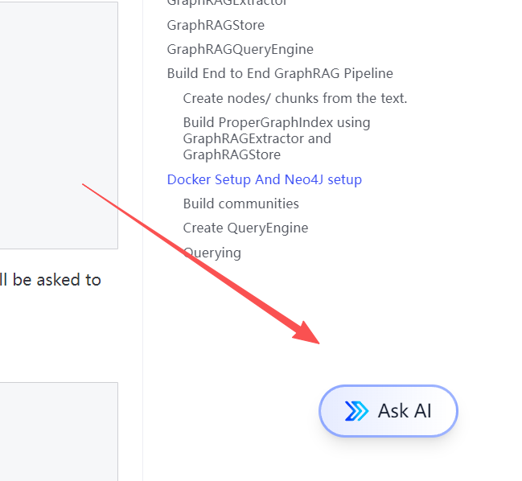

llamaindex示例地址：https://developers.llamaindex.ai/python/framework/understanding/agent/
一个强大的MCP社区的分享：https://smithery.ai/server/@JackKuo666/semanticscholar-mcp-server
llamahub:https://llamahub.ai
graphrag的示例（使用那neo4j作为库）：
neo4j网站（官方提供一个免费试用库）：https://neo4j.com/

===================================================
1.如果前端不会使用的同学，在后端开启成功后，使用以下命令进行：测试观察：

```
curl.exe -X POST ^
More? More?   -H "Content-Type: application/json" ^
More? More?   -d "{ \"query\": \"请用工具检索关于GPT-4的近期论文\" }" ^
More? More?   "http://127.0.0.1:8000/chat"

```

2.文件里的.secret替换成自己的秘钥
3.要翻墙
4.LLamaindex官方网站有AI问答功能，本身就是基于文档的RAG问答，可以利用他学习。
